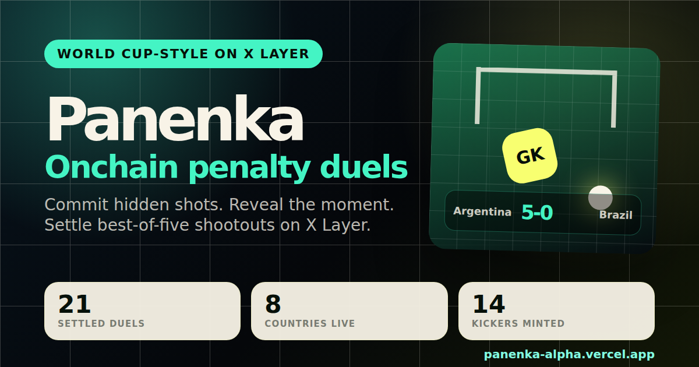

# Panenka



Hidden-plan duels on X Layer. Two wallets commit a sealed shootout strategy as a `bytes32` hash, reveal, and the contract settles an IFAB-style penalty sequence with early stops, sudden death, onchain stats, and a country leaderboard. No oracle, no live match feed, no betting.

The protocol primitive is the commit/reveal hidden-plan duel. The penalty shootout is the cultural wrapper that makes World Cup fans understand it instantly.

- Live: `https://panenka-alpha.vercel.app`
- Proof: `https://panenka-alpha.vercel.app/api/proof`
- X: `https://x.com/PanenkaGG`

V2 uses non-transferable DuelCredit instead of real-money staking to keep the demo focused on World Cup gameplay, commit/reveal fairness, no-draw settlement, and X Layer transaction proof.

Public testers can play with one wallet against Panenka Bot. The contract still enforces a real two-player duel; the bot is a server-side opponent wallet that joins and reveals with its own commitment.

Current live X Layer activity is returned by `/api/proof` and `/api/leaderboard` so the README does not go stale as testers create more duels, kickers, countries, and active player wallets.

## Why This Fits X Cup, By Criterion

- **Innovation:** the primitive is a commit/reveal hidden-plan duel. The same mechanic works for any zero-sum game with hidden choices; World Cup penalty shootouts are the first wrapper.
- **Market potential:** country kickers, country leaderboards, result sharing, and bot duels give football fans a fast reason to create X Layer transactions.
- **Completion:** contracts are deployed on X Layer testnet, the app is live, the bot path is playable with one wallet, and every settled duel has explorer proof.
- **Safety:** Panenka is a game, not a gamble. DuelCredit is non-transferable in-game credit, with no real-money betting, no official World Cup/FIFA branding, and no player likenesses.

## What Is Built

- `DuelCredit`: non-transferable in-game credit with a daily faucet and duel-only transfer route.
- `KickerNFT`: country kicker NFT with wins, losses, streak, level, and owner-controlled country switching.
- `PenaltyDuel`: create, join, commit, reveal, IFAB-style no-draw settlement, timeout cancel, and forfeit.
- Foundry tests covering the full duel lifecycle and failure cases.
- X Layer testnet deployment and first two-wallet duel proof.
- Server-side Panenka Bot endpoint for one-wallet testing.
- Public bot-readiness check so judges can see the one-wallet demo path is funded, capped, and ready before clicking.
- Homepage playable-now card shows Panenka Bot readiness, public DCR cap, and bot fuel before a tester clicks.
- Homepage activity cards show active X Layer player wallets as a market-potential signal, not just contract deployment.
- Homepage country race shows the top live countries from `KickerNFT` stats so the rivalry loop is visible in the first screen.
- Hero duel card links directly to replay, X sharing, and the latest settlement transaction.
- Replay page loads the latest settled duel from live X Layer state, with the proof duel as a fallback.
- Live leaderboard reads `KickerNFT` owner and stats state from X Layer, with both country and kicker rankings.
- Country leaderboard rows include X challenge links so the World Cup rivalry loop can spread from each onchain result.
- Settled duel screen includes a copyable tester report with result, tx link, and app URL.
- Machine-readable `/api/proof` endpoint for AI judges: X Cup track fit, game-not-gamble safety boundaries, demo path, contracts, proof txs, settled/open duel counts, no-draw settlement proof, recent duels, recent settlement tx links, and verifier marker.

## X Layer Testnet Proof

Chain: X Layer testnet (`1952`)

Exhibition runner wallets produce deterministic activity to demonstrate the full duel lifecycle at volume. Manual/tester wallets are flagged separately in `/api/proof` and `/api/leaderboard`.

### V1 and V2 evidence

Panenka keeps the original V1 proof path instead of replacing it:

- **V1 baseline proof:** the first full two-wallet duel (`#1`) is pinned below with create, join, reveal, settlement, DuelCredit, and KickerNFT stat readback.
- **V1 volume proof:** deterministic exhibition wallets demonstrate the full lifecycle at scale and are labeled as `exhibition`.
- **V2 tester proof:** external/manual testing is now visible separately from exhibition traffic. As of the latest verified snapshot on `2026-05-27`, `/api/proof` reports `24` settled duels, `14` active wallets, `6` manual/tester wallets, `8` exhibition wallets, `14` country kickers, and `8` countries represented.
- **V2 human duel examples:** recent manual/tester duels include `#21` France `4-3` Japan, `#22` France `10-11` Brazil, `#23` USA `3-0` Japan, and `#24` USA `0-3` France, each with a settlement tx returned by `/api/proof`.

The live endpoint remains the source of truth as more friends test the game:

```bash
npm run verify:live
```

Contracts:

- `DuelCredit`: [`0xcc3fa00814d3577512d419154b8e2bd2c3566071`](https://www.okx.com/web3/explorer/xlayer-test/address/0xcc3fa00814d3577512d419154b8e2bd2c3566071)
- `KickerNFT`: [`0xb1344061536397e422e4db5d536e14c9b73ca8ba`](https://www.okx.com/web3/explorer/xlayer-test/address/0xb1344061536397e422e4db5d536e14c9b73ca8ba)
- `PenaltyDuel`: [`0xb2760c0d27af86ab4e6b7b5f9c5ff7e1015ce2aa`](https://www.okx.com/web3/explorer/xlayer-test/address/0xb2760c0d27af86ab4e6b7b5f9c5ff7e1015ce2aa)

V1 baseline settled duel proof:

- Duel: `#1`
- Create duel tx: [`0xbc3118e3e017b37b35fd33efebec2326861e0c448b1bb5b73001d155120fa780`](https://www.okx.com/web3/explorer/xlayer-test/tx/0xbc3118e3e017b37b35fd33efebec2326861e0c448b1bb5b73001d155120fa780)
- Join duel tx: [`0xf833710748cd673a75c2de08207f9e984083d5fb226cc7364acd8609cad18629`](https://www.okx.com/web3/explorer/xlayer-test/tx/0xf833710748cd673a75c2de08207f9e984083d5fb226cc7364acd8609cad18629)
- Player one reveal tx: [`0x4d80a46b57c9e842794cf2a051dfe2f0474b57be3202168bff5ae3eebded8fee`](https://www.okx.com/web3/explorer/xlayer-test/tx/0x4d80a46b57c9e842794cf2a051dfe2f0474b57be3202168bff5ae3eebded8fee)
- Player two reveal and settlement tx: [`0x591cfb717624c02d2862b805237d34f9d151f3228d70bc9e7b1dd414e13c9181`](https://www.okx.com/web3/explorer/xlayer-test/tx/0x591cfb717624c02d2862b805237d34f9d151f3228d70bc9e7b1dd414e13c9181)

Recorded readback immediately after that settlement:

- Player one: Nigeria kicker, `105` DuelCredit, `1` win, `1` streak.
- Player two: France kicker, `95` DuelCredit, `1` loss.
- Score: Nigeria `3-0` France, stopped early once France could no longer catch up.

Verifier:

```bash
npm run verify:duel
```

The verifier checks the original full proof duel and the pinned repo settlement proof. Use `npm run verify:live` for the current production activity and newest tester settlement.

Expected success marker:

```text
PANENKA_DUEL_VALID
```

## Commands

```bash
pnpm install --frozen-lockfile
npm run contracts:build
npm run contracts:test
npm run app:typecheck
npm run app:build
npm run verify:duel
npm run verify:live
```

`npm run verify:live` checks the production app, `/api/proof`, `/api/leaderboard`, Panenka Bot readiness, and the latest settlement tx before recording or submitting.

Deploy after filling `.env`:

```bash
cp .env.example .env
set -a && source .env && set +a
npm run contracts:build
npm run deploy:xlayer
```

The default `.env.example` targets X Layer testnet (`chainId 1952`, RPC `https://testrpc.xlayer.tech/terigon`). Switch `XLAYER_RPC_URL` and `XLAYER_CHAIN_ID` to X Layer mainnet (`chainId 196`, RPC `https://rpc.xlayer.tech`) only after the duel loop is stable.

After deployment, run the first two-wallet proof with funded player keys:

```bash
set -a && source .env && set +a
npm run duel:xlayer
```

That script claims DuelCredit when possible, mints two kickers if needed, creates a duel, joins it, reveals both plans, and settles the match onchain.

Create exhibition activity for the final submission:

```bash
set -a && source .env && set +a
npm run exhibition:run
```

The exhibition runner derives deterministic test wallets from `EXHIBITION_SEED`, funds them from `EXHIBITION_FUNDER_PRIVATE_KEY` or `DEPLOYER_PRIVATE_KEY`, rotates countries, settles multiple duels, and prints `PANENKA_EXHIBITION_VALID`. Use it to build visible X Layer activity before recording the final demo.

Frontend:

```bash
pnpm install --frozen-lockfile
npm run app:dev
npm run app:build
```

## Contract Events

- `CreditFaucetClaimed`
- `KickerMinted`
- `KickerStatsUpdated`
- `DuelCreated`
- `DuelJoined`
- `PlayerRevealed`
- `RoundResolved`
- `DuelSettled`
- `DuelForfeited`
- `DuelCancelled`

These events are the judge-facing proof: a duel has two players, both commits are hidden until reveal, every round resolves onchain, the pot moves in DuelCredit, and kicker stats update after settlement.

## Demo Flow

1. Connect wallet.
2. If the wallet has no gas, claim X Layer testnet OKB from the official faucet: `https://web3.okx.com/en-us/xlayer/faucet`.
3. Mint or pick a country kicker.
4. Claim DuelCredit from the faucet.
5. Create a duel with a hidden commitment.
6. Click `Bot joins this duel` for one-wallet testing, or ask a human opponent to join.
7. Reveal from your wallet.
8. Click `Bot reveals and settles`, or ask the human opponent to reveal.
9. The UI shows the grass-pitch reveal animation, settlement transaction, stats update, leaderboard change, and shareable result image.

Fast judge path:

1. Open `https://panenka-alpha.vercel.app/#replay` to watch the latest settled X Layer duel without a wallet.
2. Open `https://panenka-alpha.vercel.app/#leaderboard` to see country rivalry and kicker rankings read from `KickerNFT`.
3. Open `https://panenka-alpha.vercel.app/api/proof` for machine-readable X Layer proof, `npm run verify:live` for current production activity, and `npm run verify:duel` for repo-pinned proof replay.

## Scope Guard

This MVP intentionally cuts real USDT staking, prediction markets, player likenesses, live match feeds, spectator betting, chat, and cross-chain mechanics. The winning demo is the penalty reveal loop plus verifiable X Layer events.
